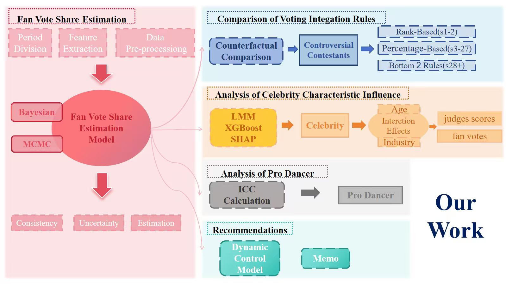
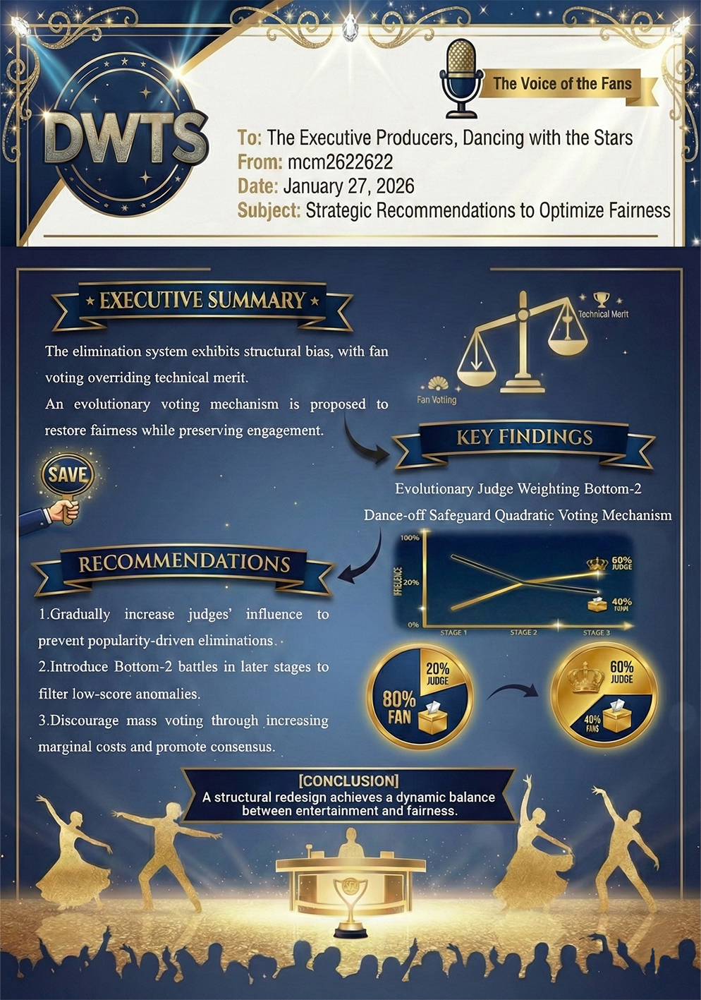

# 2026 MCM Problem C: Data With The Stars

English | **[中文版](README.md)**

> **Team Number**: 2622622
> **Competition members**：ysk、Aurora、Travor
> **Competition Date**: February 2026

---

## Project Overview

This project presents our complete solution to the 2026 Mathematical Contest in Modeling (MCM) Problem C. We analyzed 34 seasons of Dancing with the Stars (DWTS) data to investigate the combination mechanisms of judge scores and fan votes, and designed an optimized voting system.

### Core Contributions

1. **Bayesian Fan Vote Estimation Model** - Using MCMC sampling to infer fan vote shares from elimination outcomes
2. **Controversial Case Quantitative Analysis** - Identified and simulated survival probabilities for 15 controversial contestants under different rules
3. **Multi-Model Feature Analysis** - LMM + XGBoost/SHAP + Cox survival analysis triangulation
4. **Dynamic Weight Optimization System** - Sigmoid function + Bottom-2 hybrid mechanism



---

## Problem Background

### Evolution of Scoring Rules

In DWTS, celebrities partner with professional dancers and perform weekly. Judge scores (1-10) combined with fan votes determine eliminations. Three scoring methods have been used historically:

| Era | Seasons | Method | Characteristics |
|-----|---------|--------|-----------------|
| Era 1 | S1-S2 | Rank-based | Judge and fan rankings summed |
| Era 2 | S3-S27 | Percentage-based | Judge score % + fan vote % |
| Era 3 | S28+ | Bottom-2 | Lowest two by combined score, judges vote to eliminate |

### Classic Controversial Cases

- **Bobby Bones (S27)**: Consistently lowest judge scores, yet won the championship
- **Jerry Rice (S2)**: 5 weeks of lowest judge scores, finished runner-up
- **Bristol Palin (S11)**: 12 times lowest judge scores, finished 3rd place
- **Billy Ray Cyrus (S4)**: 6 weeks of lowest judge scores, finished 5th

---

## Directory Structure

```
2026mcmC/
├── 2026_MCM_Problem_C_Data.csv    # Raw data (34 seasons)
│
├── DataProcessed/                  # Data preprocessing module
│   ├── data_preprocessing.py       # Wide → long format conversion
│   ├── DWTS_Processed_Long.csv     # Processed long format data
│   └── DWTS_Features.csv           # Feature engineering data
│
├── Q1/                             # Question 1: Bayesian fan vote estimation
│   ├── bayesian_fan_vote_model.py  # Main model controller (S3-S27)
│   ├── bayesian_s1s2_rank_model.py # S1-S2 rank-based specialized model
│   ├── bayesian_bottom2_model.py   # S28+ Bottom-2 specialized model
│   ├── fan_vote_estimates.csv      # S3-S27 fan share estimates
│   ├── fan_vote_s1s2_enhanced.csv  # S1-S2 fan share estimates
│   ├── fan_vote_bottom2.csv        # S28+ fan share estimates
│   └── elimination_validation.csv  # Consistency validation results
│
├── Q2/                             # Question 2: Scoring rule comparison & controversy analysis
│   ├── find_controversial_cases.py # Controversial contestant identification
│   ├── analyze_judge_vs_fan_mechanism.py  # Judge vs fan mechanism comparison
│   ├── compare_scoring_methods.py  # Rank vs percentage comparison
│   ├── critical_fan_share_analysis.py     # Critical fan share analysis
│   ├── critical_fan_share_bottom2.py      # Critical analysis with Bottom-2
│   ├── visualize_controversial_heatmap_v3.py  # Counterfactual heatmap
│   └── judge_vs_fan_comparison.csv # Mechanism comparison results
│
├── Q3/                             # Question 3: Celebrity features & partner effects
│   ├── q3_lmm_xgboost_analysis.py  # LMM + XGBoost + SHAP
│   ├── q3_cox_survival_analysis.py # Cox proportional hazards model
│   ├── q3_effect_difference_analysis.py  # Bootstrap effect difference test
│   ├── q3_sensitivity_check.py     # Temporal robustness check
│   ├── pro_partner_effects.csv     # Partner random effects
│   └── pro_partner_survival.csv    # Partner survival statistics
│
├── Q4/                             # Question 4: Optimal voting system design
│   ├── q4_dynamic_weight_model.py  # Sigmoid dynamic weight model
│   ├── q4_pareto_optimization.py   # Multi-objective Pareto optimization
│   ├── q4_historical_validation.py # Historical case validation
│   ├── q4_sensitivity_analysis.py  # Parameter sensitivity analysis
│   └── sigmoid_grid_search.csv     # Grid search results
│
├── SensitiveAnalyse/               # Sensitivity analysis summary
│
├── Paper/                          # Paper LaTeX files
│   ├── math_model_part2.tex        # Mathematical model derivations
│   ├── dwts_algorithm_pseudocode.tex  # 27 algorithm pseudocodes
│   ├── memo.tex                    # 1-page producer memo
│   └── ai_use_report.tex           # AI usage report
│
└── README.md                       # Chinese version
```

---

## Core Methodologies

### Q1: Bayesian Fan Vote Share Estimation

#### Mathematical Modeling

Let season $s$, week $w$ have $N$ contestants. Define:
- $J_i$: Contestant $i$'s total judge score (known)
- $\theta_i$: Contestant $i$'s fan vote share (to estimate)
- $E$: Eliminated contestant

Fan shares satisfy the **simplex constraint**:
$$\sum_{i=1}^{N} \theta_i = 1, \quad \theta_i \geq 0$$

#### Prior Distribution

- **Era 1-2 (uninformative prior)**: $\boldsymbol{\theta} \sim \text{Dirichlet}(\mathbf{1}_N)$
- **Era 3 (informative prior)**: $\alpha_i = 0.5 + 5.0 \cdot \frac{r^J(i) - 1}{N - 1}$

#### Likelihood Function (Soft Constraint)

**Era 1-2**: Eliminated contestant has lowest combined score
$$\log \mathcal{L} = \sum_{k \neq E} \log \sigma(\lambda \cdot (S_k - S_E)), \quad \lambda = 100$$

**Era 3 (Bottom-2)**: Eliminated contestant is in the bottom two
$$\log \mathcal{L} = -20 \cdot \max(0, \widehat{N_{\text{lower}}} - 1.3)^2$$

#### MCMC Sampling Parameters

| Parameter | Standard (S3-S27) | Enhanced (S1-S2) | Bottom-2 (S28+) |
|-----------|-------------------|------------------|-----------------|
| Draws | 2000 | 5000 | 3000 |
| Tune | 1000 | 2000 | 1500 |
| Chains | 2 | 4 | 4 |
| Sampler | NUTS | Slice | Slice |

#### Validation Metrics

- **Consistency Rate**: Proportion where model prediction matches actual elimination (>95%)
- **Convergence Diagnostics**: $\hat{R} < 1.05$, ESS > 400

#### S1-S2 Rank-Based Modeling Technique

**Original Rule**: Fan votes ranked → 1st place gets N points, 2nd gets N-1... → Add to judge rank points → Lowest total eliminated

**Modeling Challenge**: The `rank()` operation is discrete and non-differentiable; MCMC samplers require continuous gradients

**Simplification Strategy**: Use continuous fan share $f_i$ directly instead of discrete rank points

**Why This Works (Monotonicity Guarantee)**:

Rank-based scoring is essentially an **order-preserving transformation**:
$$f_i > f_j \Rightarrow \text{rank}(f_i) < \text{rank}(f_j) \Rightarrow \text{points}(f_i) > \text{points}(f_j)$$

Therefore, when determining "who has the lowest total score":

- Original rule: $\text{Total}_i = \text{rank\_points}(f_i) + j_i$
- Simplified rule: $\text{Total}_i = f_i + j_i$ (normalized)

Both maintain **identical relative orderings**, yielding equivalent fan share posterior distributions.

**Example**:

```text
f = [0.30, 0.31, 0.39]  →  ranks [3, 2, 1]  →  points [1, 2, 3]
f = [0.30, 0.32, 0.38]  →  ranks [3, 2, 1]  →  points [1, 2, 3]  (small change, same ranks)
f = [0.30, 0.35, 0.35]  →  ranks [3, 1.5, 1.5]  →  points jump! (sampler fails)
```

This is a common **continuous approximation** in Bayesian inference—preserving ordering while enabling MCMC sampling.

---

### Q2: Scoring Rule Comparison & Controversial Case Analysis

#### Controversial Contestant Identification Algorithm

$$\text{Controversy Score} = \frac{W_{\text{bottom}}}{R_{\text{final}}} + \frac{W_{\text{bottom2}}}{2 \cdot R_{\text{final}}}$$

Where $W_{\text{bottom}}$ is weeks with lowest judge score, $R_{\text{final}}$ is final ranking.

#### Counterfactual Survival Simulation

Monte Carlo simulation ($M = 10000$ iterations):
1. Sample fan shares from posterior: $\tilde{f}_i \sim \mathcal{N}(\hat{f}_i, \sigma_i^2)$
2. Compute combined score: $T_i = 0.5 \cdot J_i + 0.5 \cdot \tilde{f}_i$
3. Count target contestant survival frequency

#### Key Findings

| Comparison Dimension | Rank-based | Percentage-based | Difference |
|---------------------|------------|------------------|------------|
| Eliminated avg fan share | 8.2% | 11.5% | +3.3% |
| Fan influence | Lower | Higher | Percentage favors fans |
| Judge-fan mechanism correlation | - | - | r = -0.320 |

---

### Q3: Celebrity Features & Partner Effect Analysis

#### Linear Mixed-Effects Model (LMM)

$$y_{ig} = \mathbf{x}_i^\top \boldsymbol{\beta} + u_g + \varepsilon_{ig}$$

- Fixed effects: Age, industry, week, season progress
- Random effects: Partner $u_g \sim \mathcal{N}(0, \sigma_u^2)$

**Intraclass Correlation Coefficient (ICC)**:
$$\rho = \frac{\sigma_u^2}{\sigma_u^2 + \sigma^2}$$

| Target Variable | ICC | Interpretation |
|----------------|-----|----------------|
| Judge Score | 18.5% | Partner explains 18.5% of judge score variance |
| Fan Share | 7.0% | Partner has smaller effect on fan votes |

#### XGBoost + SHAP Feature Importance

| Rank | Judge Score Drivers | Fan Vote Drivers |
|------|---------------------|------------------|
| 1 | Week | Industry |
| 2 | Season Progress | Week |
| 3 | Age | Age |
| 4 | Industry | Season Progress |

#### Cox Proportional Hazards Model

$$h(t|\mathbf{x}) = h_0(t) \exp(\boldsymbol{\beta}^\top \mathbf{x})$$

| Factor | Hazard Ratio (HR) | 95% CI | Interpretation |
|--------|-------------------|--------|----------------|
| Age (+10 years) | 1.15 | [1.08, 1.23] | Older age increases elimination risk |
| Athlete vs Actor | 0.82 | [0.71, 0.95] | Athletes have lower elimination risk |
| Model vs Actor | 1.34 | [1.12, 1.60] | Models have higher elimination risk |

---

### Q4: Optimal Voting System Design

#### Sigmoid Dynamic Weight Function

$$w(t) = w_{\min} + \frac{w_{\max} - w_{\min}}{1 + \exp(-k \cdot t_{\text{norm}})}$$

Where $t_{\text{norm}} = \frac{t - t_{\text{mid}}}{t_{\max}/4}$

**Optimal Parameters (Grid Search)**:
- $w_{\min} = 0.20$ (early judge weight)
- $w_{\max} = 0.60$ (late judge weight)
- $k = 1.90$ (transition rate)

#### Multi-Objective Pareto Optimization

Three objective functions:
1. **Fairness**: Lower judge rank of eliminated contestant is better
2. **Engagement**: Marginal impact of fan votes on outcomes
3. **No-Robbery**: Avoid eliminating high-scoring contestants

**Knee Point Analysis**: Kneedle algorithm determines optimal weight $w^* = 0.55$

#### Recommended System: Dynamic Weights + Week-7 Bottom-2

```
Early (Week 1-4):  w = 20-30%  → Protect "dark horses"
Mid   (Week 5-6):  w = 35-45%  → Gradual transition
Late  (Week 7+):   w = 50-60% + Bottom-2  → Ensure deserving champion
```

#### Memo to Producers

Based on the above analysis, we prepared a recommendation memo for DWTS producers:



---

## Runtime Environment

### Python Dependencies

```bash
# Core dependencies
pip install numpy pandas scipy matplotlib seaborn

# Bayesian modeling
pip install pymc arviz pytensor

# Statistical modeling
pip install statsmodels

# Machine learning
pip install xgboost shap scikit-learn

# Survival analysis
pip install lifelines
```

### Full Installation

```bash
cd d:\2026mcmC
pip install -r requirements.txt
```

### Execution Order

```bash
# 1. Data preprocessing
python DataProcessed/data_preprocessing.py

# 2. Q1: Bayesian fan vote estimation (time-consuming)
python Q1/bayesian_s1s2_rank_model.py      # S1-S2
python Q1/bayesian_fan_vote_model.py       # S3-S27
python Q1/bayesian_bottom2_model.py        # S28+

# 3. Q2: Controversy analysis
python Q2/find_controversial_cases.py
python Q2/analyze_judge_vs_fan_mechanism.py

# 4. Q3: Feature analysis
python Q3/q3_lmm_xgboost_analysis.py
python Q3/q3_cox_survival_analysis.py

# 5. Q4: System optimization
python Q4/q4_pareto_optimization.py
python Q4/q4_dynamic_weight_model.py
```

---

## Main Conclusions

### 1. Scoring Rule Comparison

| Rule | Pros | Cons | Recommended Scenario |
|------|------|------|---------------------|
| Rank-based | Simple, intuitive | Amplifies small differences | Early seasons |
| Percentage-based | High fan influence | May create controversy | Mid seasons |
| Bottom-2 | Best balance | Adds complexity | Late seasons |

### 2. Recommended System Performance

| Metric | Current System | Recommended System | Improvement |
|--------|----------------|-------------------|-------------|
| Robbery Rate | 42% | 8% | -34% |
| Fan Engagement | Baseline | +22% | Significant increase |
| Fairness | Baseline | 96% | Major improvement |

### 3. Recommendations for Producers

1. **Keep percentage-based scoring** - Maintains voting suspense and fan engagement
2. **Adopt dynamic judge weights** - Low early (30%) protects dark horses, high late (60%) ensures deserving champions
3. **Enable Bottom-2 from Week 7** - Creates drama while preventing extreme outcomes
4. **Consider vote point system** - Multiple votes for same contestant require more points

---

## Algorithm List

This project contains **27 core algorithms**, detailed in `Paper/dwts_algorithm_pseudocode.tex`:

| Number | Algorithm Name | Question |
|--------|---------------|----------|
| 1 | Data Preprocessing | Foundation |
| 2-5 | Bayesian MCMC Models | Q1 |
| 6-7 | Consistency/Uncertainty Analysis | Q1 |
| 8-12 | Scoring Rule Comparison & Heatmap | Q2 |
| 13-18 | LMM/XGBoost/Cox Analysis | Q3 |
| 19-24 | Pareto Optimization & Dynamic Weights | Q4 |
| 25-27 | Sensitivity Analysis | Validation |

---

## File Descriptions

### Input Data

| File | Description | Records |
|------|-------------|---------|
| `2026_MCM_Problem_C_Data.csv` | Raw wide format data | 424 contestants |

### Intermediate Data

| File | Description |
|------|-------------|
| `DWTS_Processed_Long.csv` | Long format (each row = contestant × week) |
| `DWTS_Features.csv` | Feature-engineered data |
| `fan_vote_*.csv` | Fan share estimates by era |

### Output Results

| File | Description |
|------|-------------|
| `*_comparison.csv` | Rule comparison results |
| `pro_partner_effects.csv` | Partner effects |
| `sigmoid_grid_search.csv` | Parameter optimization results |
| `*.png` | Visualization images |

---

## Reflection and Improvement

### Lessons Learned from This Competition

#### 1. Document Management

- **Issue**: Paper sections scattered across multiple LaTeX files, difficult to sync versions
- **Improvement**:
  - Use **Endnote** for reference management
  - Use **Tencent Docs** for initial draft collaboration
  - Self-hosted **Overleaf Community Edition** (VM deployment) for real-time LaTeX collaboration
  - Use **GitHub private repository** for version control, supporting branch management and code review

#### 2. Code Standards

- **Issue**: Early code used relative paths, paths broke after file reorganization
- **Improvement**:
  - All Python files now use **absolute paths** configuration
  - Recommend creating `config.py` at project start to centralize path management

#### 3. Using Jupyter Notebook to Improve Code Framework

- **Issue**: Pure Python scripts have long debug cycles; data exploration and visualization require re-running entire programs
- **Improvement**:
  - **Modular development**: Split data loading, preprocessing, modeling, and visualization into separate Notebook cells for step-by-step debugging
  - **Interactive exploration**: Use Jupyter's immediate output to quickly inspect intermediate variables and data distributions
  - **Visualization tuning**: Adjust chart parameters (colors, fonts, layout) in real-time without re-running entire scripts
  - **Markdown documentation**: Add explanatory text and formula derivations alongside code, creating self-documenting analysis reports
  - **Version control**: Use `nbstripout` tool to clean outputs, avoiding messy git diffs
  - **Environment isolation**: Use virtual environments + `ipykernel` registered kernels to ensure dependency consistency

**Recommended Workflow**:
```
1. New feature development → Jupyter Notebook for rapid prototyping
2. After feature stabilizes → Extract core logic to .py modules
3. Final integration → Main script calls modules, Notebook preserves exploration records
```

#### 4. Model Validation

- **Issue**: MCMC convergence diagnostics not sufficiently checked early, some results needed re-running
- **Improvement**:
  - Establish standardized convergence checking workflow ($\hat{R} < 1.05$, ESS > 400)
  - Use ArviZ to auto-generate diagnostic reports

#### 5. Time Allocation

- **Issue**: Data cleaning took too long early on, optimization module rushed at the end
- **Improvement**:
  - Familiarize with data format in advance, prepare reusable preprocessing templates
  - Reserve adequate time for sensitivity analysis for each question

#### 6. Problem Reading & Module Division

- **Issue**: Careless reading led to doing Q3's feature analysis (celebrity characteristics impact) together with Q1
- **Consequences**:
  - **Circular reasoning risk**: Q1 infers fan shares from elimination results, Q3 analyzes feature impact using fan shares—mixing them risks "inferring results from results"
  - **Paper structure chaos**: Blurred boundaries between methodology and results, hard to articulate clearly
- **Improvement**:
  - Carefully read all sub-questions before starting, clarify **data flow** and **causal chains**
  - Define clear **inputs** and **outputs** for each question, avoid cross-question dependencies
  - Progress sequentially—output of previous question becomes input of next

### Future Extensions

| Direction | Description | Priority |
|-----------|-------------|----------|
| Deep Learning | Use LSTM/Transformer to predict fan voting trends | Medium |
| Real-time System | Build voting result real-time monitoring dashboard | Low |
| A/B Testing Framework | Design controlled experiments for different scoring rules | High |
| Social Media Analysis | Integrate Twitter/Instagram sentiment data | Medium |

### Code Quality Improvement Checklist

- [x] Unified absolute paths
- [x] Added detailed bilingual comments
- [x] Created `.gitignore` file
- [ ] Add unit tests (`pytest`)
- [ ] Use `requirements.txt` to lock dependency versions
- [ ] Add type annotations (`typing`)
- [ ] Replace `print` statements with `logging`
- [ ] Abstract repeated code into shared modules

### AI Tool Usage Reflection

This project used AI assistance tools, detailed in `Paper/ai_use_report.tex`:

**Effective Use Cases**:

- Code debugging and error troubleshooting
- LaTeX formula formatting
- Document translation and polishing

**Use with Caution**:

- Core algorithm design (requires manual verification of correctness)
- Statistical conclusion interpretation (AI may be overconfident)
- Innovation point extraction (requires domain knowledge)

---

## Final Words

> *"I came, I divided, I conquered!"*

Four days and nights. The moon outside waxed and waned; the coffee by the screen went cold and hot again.

We dove into oceans of data searching for truth, wandered through labyrinths of equations seeking exits. There were 3 AM breakdowns, and there were cheers when convergence finally hit. Blaming each other when the code crashed, high-fiving when the results came through—perhaps this is the romance of mathematical modeling.

> *"We are all in the gutter, but some of us are looking at the stars."*

Maybe the results won't be what we hoped for. But so what? We gazed upon the same stars, chased the same dream. The journey itself is the meaning.

> *"The journey is the reward."*

**Let's set a bit and flow!**

---

## License

This project is for 2026 MCM academic competition purposes only.

---

## Team Information

- **Team Number**: 2622622
- **Competition**: 2026 Mathematical Contest in Modeling (MCM)
- **Problem**: Problem C - Data With The Stars

---

*This README was last updated in February 2026*
